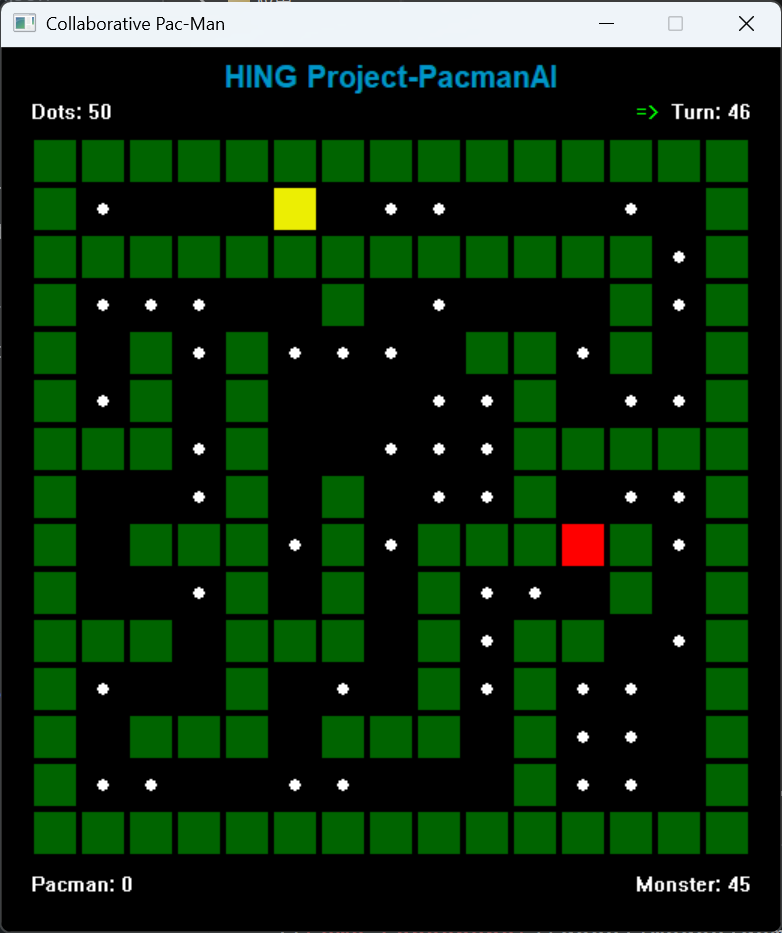

# Collaborative Pac-Man Game

> 一个基于 C++ 的协作式吃豆人游戏教学项目
> 由成都大学 HING 游戏开发学习小组开发

<p align="center">
  
</p>

---

## 项目简介

**测试 PR 工作流 - 此行将在测试后删除**

这是一个专为**游戏开发初学者**设计的协作式教学项目。通过实现经典的吃豆人游戏，学生可以学习到游戏开发的核心概念：AI 决策、游戏规则管理、状态管理和回合制系统。

### 项目意义

**🎓 教学价值**
- **分工协作**：三个学生分别负责不同模块，模拟真实团队开发
- **循序渐进**：从简单的随机移动到复杂的路径规划，难度可调
- **即时反馈**：可视化界面让学生直观看到 AI 的行为表现
- **实战经验**：接触真实的游戏开发架构和设计模式

**🎮 游戏开发核心概念**
- **AI 决策系统**：如何让角色"思考"并做出决策
- **信息不对称**：有限视野下的策略博弈
- **回合制架构**：游戏循环、状态管理、回放系统
- **模块化设计**：清晰的接口分离，易于扩展

**👥 团队协作能力**
- 学生 A 实现吃豆人 AI（收集豆子、躲避怪物）
- 学生 B 实现怪物 AI（追踪吃豆人、围堵策略）
- 学生 C 实现管理系统（碰撞检测、游戏规则、胜负判定）

---

## 核心功能

### ✅ 已实现的框架功能

**游戏核心系统**
- ✅ 回合制游戏循环
- ✅ 随机地图生成（递归分割算法）
- ✅ 游戏状态管理
- ✅ 碰撞检测与规则判定

**视野系统**
- ✅ 有限视野机制（信息不对称）
- ✅ 吃豆人视野半径：4 格（9×9 网格）
- ✅ 怪物视野半径：3 格（7×7 网格）
- ✅ Bresenham 算法实现墙壁遮挡

**AI 接口**
- ✅ 简洁的 AI 接口设计
- ✅ 只接收可见区域，无法获取全局坐标
- ✅ 示例 AI 实现（随机移动 + 避墙）

**渲染系统**
- ✅ Windows GDI 双缓冲渲染
- ✅ 60 FPS 显示
- ✅ 实时显示分数、回合数、剩余豆子

**回放控制**
- ✅ 游戏暂停/继续
- ✅ 单步前进/后退
- ✅ 回到起点重新播放
- ✅ 状态历史记录（最多 100 回合）

**键盘控制**
- `Space` - 暂停/继续
- `←` - 后退一步
- `→` - 前进一步
- `R` - 回到起点

---

## 学生任务与切入点

### 📘 学生 A - Pacman AI

**文件位置**：`src/agents/pacman_ai.cpp`

**核心方法**：
```cpp
Action PacmanAI::getAction(const VisibleArea &visibleArea)
```

**任务目标**：
- 收集尽可能多的豆子
- 避免被怪物抓住
- 实现高效的移动策略

**难度梯度**：
1. **初级**：寻找最近的豆子并移动
2. **中级**：检测怪物并逃跑
3. **高级**：路径规划（BFS/A*）+ 危险评估

**优势**：视野半径 4 格，比怪物看得更远！

---

### 📕 学生 B - Monster AI

**文件位置**：`src/agents/monster_ai.cpp`

**核心方法**：
```cpp
Action MonsterAI::getAction(const VisibleArea &visibleArea)
```

**任务目标**：
- 追踪并抓住吃豆人
- 实现有效的围堵策略
- 多怪物协作（如果有多个怪物）

**难度梯度**：
1. **初级**：看到吃豆人就直接追
2. **中级**：记住上次看到的位置，持续追踪
3. **高级**：预判吃豆人移动 + 多怪物协作围堵

**挑战**：视野半径只有 3 格，需要更聪明的策略！

---

### 📗 学生 C - Management System

**文件位置**：`src/management/management_system.cpp`

**核心方法**：
```cpp
bool ManagementSystem::processActions(const std::vector<Action> &actions,
                                      GameStateManager &gameState)
```

**任务目标**：
- 处理所有角色的移动
- 检测碰撞（吃豆人与怪物）
- 判定游戏胜负条件
- 管理分数系统

**难度梯度**：
1. **初级**：基础碰撞检测 + 豆子收集
2. **中级**：完整的游戏规则 + 分数系统
3. **高级**：回合限制 + 复杂分数机制 + 特殊规则

**责任**：确保游戏公平、规则正确！

---

## 快速开始

### 环境要求
- **操作系统**：Windows
- **编译器**：MSVC (Visual Studio C++)
- **构建工具**：CMake 3.15+
- **C++ 标准**：C++17

### 编译运行

```bash
# 1. 生成构建文件
cmake -B build -G Ninja

# 2. 编译项目
cmake --build build

# 3. 运行游戏
build\pacman_game.exe
```

### 修改 AI 后重新编译

```bash
# 只需重新编译即可
cmake --build build
```

### 团队协作流程

如果你是团队成员，需要使用 Git 进行协作开发，请查看：
- **[工作流程指南](docs/WORKFLOW.md)** - 完整的 Git/GitHub 协作流程

---

本项目由 HING 小组成员共同开发，作为教学框架供学习使用。


**祝学习愉快！🎮**
